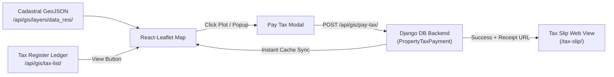

# Property Tax & Cadastral Revenue System - Frontend API & React.js Integration Guide

Welcome to the **Property Tax & Cadastral Revenue System** API implementation documentation. This guide is tailored specifically for **Frontend Developers (React.js, Next.js, React-Leaflet, and Mapbox GL)** to integrate property tax assessments, citizen payment portals, cadastral GIS mapping, tax registers, and receipt generation.

---

## 📋 Table of Contents

1. [System Architecture & Workflow Overview](#1-system-architecture--workflow-overview)
2. [Base URL, Headers & Authentication](#2-base-url-headers--authentication)
3. [TypeScript Data Types & Interfaces](#3-typescript-data-types--interfaces)
4. [Master API Endpoints Reference](#4-master-api-endpoints-reference)
   - [4.1 Submit Tax Payment API (`POST /api/gis/pay-tax/`)](#41-submit-tax-payment-api-post-apigispay-tax)
   - [4.2 Verify Tax Payment Status API (`GET /api/gis/pay-tax/`)](#42-verify-tax-payment-status-api-get-apigispay-tax)
   - [4.3 Tax Assessment Register List API (`GET /api/gis/tax-list/`)](#43-tax-assessment-register-list-api-get-apigistax-list)
   - [4.4 Residential Cadastral GeoJSON Layer (`GET /api/gis/layers/data_resi/`)](#44-residential-cadastral-geojson-layer-get-apigislayersdata_resi)
   - [4.5 Official Tax Slip Receipt Web View (`GET /tax-slip/`)](#45-official-tax-slip-receipt-web-view-get-tax-slip)
5. [Cadastral GIS Map Styling Rules (Red vs Green)](#5-cadastral-gis-map-styling-rules-red-vs-green)
6. [Tax Calculation Logic (Turf.js Polygon Area)](#6-tax-calculation-logic-turfjs-polygon-area)
7. [React.js Implementation Snippets](#7-reactjs-implementation-snippets)
   - [7.1 API Service Module (`propertyTaxService.ts`)](#71-api-service-module-propertytaxservicets)
   - [7.2 Interactive Cadastral Map (`CadastralTaxMap.jsx` with `react-leaflet`)](#72-interactive-cadastral-map-cadastraltaxmapjsx-with-react-leaflet)
   - [7.3 Tax Assessment Register Table (`TaxRegisterModal.jsx`)](#73-tax-assessment-register-table-taxregistermodaljsx)
   - [7.4 Quick Payment Modal (`PayTaxDialog.jsx`)](#74-quick-payment-modal-paytaxdialogjsx)
8. [Crucial Frontend Gotchas & Best Practices](#8-crucial-frontend-gotchas--best-practices)

---

## 1. System Architecture & Workflow Overview

The Property Tax & Revenue module provides an end-to-end municipal cadastral assessment system:
1. **Cadastral Plots on Map**: 731+ residential properties loaded from Geopackage (`data.gpkg` / layer `data_resi`).
2. **Dynamic Tax Calculation**: Cadastral polygon coordinates converted to square feet via Turf.js (`1 sqm = 10.7639 sq.ft`), multiplied by standard municipal base rate (₹50 / sq.ft) + 5% Urban Development Cess.
3. **Real-Time Map Coloring**:
   - **GREEN (`#22c55e`)**: Properties with confirmed tax payment for current assessment cycle.
   - **RED (`#ef4444`)**: Properties with pending / due taxes.
   - **GOLD (`#ffcc00`)**: Currently selected / inspected plot with interactive action popup.
4. **Instant Synchronization**: When a citizen pays tax via UPI/Card, the backend records the transaction, assigns a unique `TX-YYYYMM-NAL-XXXXX` receipt number, and the GeoJSON layer immediately renders the plot in Green without manual refresh.



---

## 2. Base URL, Headers & Authentication

### 2.1 Base URLs
- **Local Development Server:** `http://127.0.0.1:8000`
- **Staging / Production:** `https://your-domain.gov.in`

### 2.2 Headers
All endpoints support public access (`AllowAny`) for citizen transparency and open portal use. If making authenticated administrative calls, pass standard JWT:
```http
Content-Type: application/json
Accept: application/json
Authorization: Bearer <your_jwt_access_token>
```

---

## 3. TypeScript Data Types & Interfaces

Create a types file, e.g. `src/types/propertyTax.ts`:

```typescript
export type PaymentMode = 'UPI' | 'NET_BANKING' | 'CARD' | 'CASH' | 'CHEQUE';
export type TaxPaymentStatus = 'PAID' | 'DUE' | 'UNPAID' | 'FAILED';

export interface TaxSummaryKPIs {
  total_properties: number;
  paid_count: number;
  unpaid_count: number;
  total_tax_collected: number;
  collection_rate_pct: number;
}

export interface PaginationMeta {
  page: number;
  page_size: number;
  total_items: number;
  total_pages: number;
  has_next: boolean;
  has_previous: boolean;
}

export interface PropertyTaxRecord {
  plot_id: number;
  plot_no: string;
  owner_name: string;
  mobile: string;
  package_name: string;
  sub_class: string;
  status: 'PAID' | 'UNPAID';
  map_color: string;
  is_paid: boolean;
  estimated_tax?: number;
  estimated_area_sqft?: number | string;
  receipt_no?: string;
  transaction_id?: string;
  assessment_year?: string;
  period_month?: string;
  base_tax?: number;
  cess?: number;
  total_paid?: number;
  payment_mode?: PaymentMode;
  paid_at?: string;
  receipt_url?: string;
}

export interface TaxListResponse {
  status: 'success' | 'error';
  filter_applied: 'all' | 'paid' | 'unpaid';
  search_query: string;
  summary: TaxSummaryKPIs;
  pagination: PaginationMeta;
  results: PropertyTaxRecord[];
}

export interface PayTaxRequestPayload {
  id?: string | number;           // e.g., "data_resi_26062" or 26062
  plot_id?: number;               // 26062
  plot_no: string;                // "108"
  name: string;                   // "Ram Singh"
  mobile?: string;                // "7217052558"
  area_sqft: number;              // 682.33
  tax_amount: number;             // 34117.00
  payment_mode?: PaymentMode;     // Default: 'UPI'
  remarks?: string;
  assessment_year?: string;       // Default: '2026-2027'
  period_month?: string;          // Default: '2026-09'
}

export interface PayTaxSuccessResponse {
  status: 'success';
  message: string;
  data: {
    payment_id: number;
    receipt_no: string;
    transaction_id: string;
    plot_id: number;
    plot_no: string;
    owner_name: string;
    mobile: string;
    assessment_year: string;
    period_month: string;
    area_sqft: number;
    rate_per_sqft: number;
    base_tax: number;
    cess_5_percent: number;
    total_amount: number;
    payment_mode: PaymentMode;
    payment_status: 'PAID';
    paid_at: string;
    receipt_url: string;
  };
}

export interface CadastralFeatureProperties {
  plot_no: string;
  name: string;
  mobile: string;
  sub_class: string;
  shape_leng: number;
  code?: string;
  class?: string;
  meta_id?: string;
  add_info?: string;
  photo?: string;
  feature_name: string;
  layer_name: 'data_resi';
  is_paid: boolean;
  tax_status: 'PAID' | 'UNPAID';
  receipt_no?: string;
  transaction_id?: string;
  paid_amount?: number;
  paid_at?: string;
}
```

---

## 4. Master API Endpoints Reference

### 4.1 Submit Tax Payment API (`POST /api/gis/pay-tax/`)

Process online tax payment for a cadastral parcel.

- **URL:** `/api/gis/pay-tax/`
- **Alias URL:** `/api/property-tax/pay/`
- **Method:** `POST`
- **Auth:** Public (`AllowAny`) / Optional Bearer Token

#### Request Body (JSON)
| Field | Type | Required | Description | Example |
| :--- | :---: | :---: | :--- | :--- |
| `id` / `plot_id` | String / Number | Recommended | Feature / Plot ID from GeoJSON layer | `"data_resi_26062"` or `26062` |
| `plot_no` | String | Yes* | Cadastral plot number | `"108"` |
| `name` | String | Yes* | Property owner name | `"Ram Singh"` |
| `mobile` | String | Optional | 10-digit mobile number | `"7217052558"` |
| `area_sqft` | Number | Optional | Cadastral area in sq. feet (computed via Turf.js) | `682.33` |
| `tax_amount` | Number | Optional | Base tax in INR (Defaults to area * ₹50) | `34117.00` |
| `payment_mode` | String | Optional | Mode of transaction (`UPI`, `CARD`, `NET_BANKING`, `CASH`) | `"UPI"` |
| `remarks` | String | Optional | Notes or transaction remarks | `"Online self-assessment"` |
| `assessment_year` | String | Optional | Assessment fiscal year | `"2026-2027"` |
| `period_month` | String | Optional | Assessment month (`YYYY-MM`) | `"2026-09"` |

*\*Note: At least one of `plot_id`, `plot_no`, or `name` must be provided.*

#### Sample Request:
```bash
curl -X POST http://127.0.0.1:8000/api/gis/pay-tax/ \
  -H "Content-Type: application/json" \
  -d '{
    "id": "data_resi_26062",
    "plot_no": "108",
    "name": "Ram Singh",
    "mobile": "7217052558",
    "area_sqft": 682.33,
    "tax_amount": 34117.00,
    "payment_mode": "UPI",
    "remarks": "Online self-assessment payment"
  }'
```

#### Sample Response (`200 OK` / `201 Created`):
```json
{
  "status": "success",
  "message": "Property tax payment processed successfully.",
  "data": {
    "payment_id": 2,
    "receipt_no": "TX-202609-NAL-10380",
    "transaction_id": "NALPAY-713A1848D9",
    "plot_id": 26062,
    "plot_no": "108",
    "owner_name": "Ram Singh",
    "mobile": "7217052558",
    "assessment_year": "2026-2027",
    "period_month": "2026-09",
    "area_sqft": 682.33,
    "rate_per_sqft": 50.0,
    "base_tax": 34117.0,
    "cess_5_percent": 1705.85,
    "total_amount": 35822.85,
    "payment_mode": "UPI",
    "payment_status": "PAID",
    "paid_at": "2026-09-17T05:01:59.866437+00:00",
    "receipt_url": "http://127.0.0.1:8000/tax-slip/?id=data_resi_26062&plot_no=108&name=Ram+Singh&mobile=7217052558&tax=34117.0&receipt_no=TX-202609-NAL-10380&txn_id=NALPAY-713A1848D9"
  }
}
```

---

### 4.2 Verify Tax Payment Status API (`GET /api/gis/pay-tax/`)

Check if a plot or citizen has already paid their property tax.

- **URL:** `/api/gis/pay-tax/`
- **Alias URL:** `/api/property-tax/status/`
- **Method:** `GET`
- **Query Parameters:**
  - `?plot_no=108` (Lookup by plot number)
  - `?mobile=7217052558` (Lookup by mobile number)
  - `?receipt_no=TX-202609-NAL-10380` (Lookup by receipt number)
  - `?txn_id=NALPAY-713A1848D9` (Lookup by transaction ID)

#### Sample Request:
```bash
curl -X GET "http://127.0.0.1:8000/api/gis/pay-tax/?plot_no=108"
```

#### Sample Response:
```json
{
  "status": "success",
  "is_tax_paid": true,
  "total_records": 1,
  "payments": [
    {
      "receipt_no": "TX-202609-NAL-10380",
      "transaction_id": "NALPAY-713A1848D9",
      "plot_no": "108",
      "owner_name": "Ram Singh",
      "mobile": "7217052558",
      "assessment_year": "2026-2027",
      "period_month": "2026-09",
      "area_sqft": 682.33,
      "rate_per_sqft": 50.0,
      "base_tax": 34117.0,
      "cess_5_percent": 1705.85,
      "total_paid": 35822.85,
      "payment_mode": "UPI",
      "payment_status": "PAID",
      "paid_at": "2026-09-17T05:01:59.866437+00:00",
      "receipt_url": "http://127.0.0.1:8000/tax-slip/?id=data_resi_26062&plot_no=108&name=Ram+Singh&mobile=7217052558&tax=34117.0&receipt_no=TX-202609-NAL-10380&txn_id=NALPAY-713A1848D9"
    }
  ]
}
```

---

### 4.3 Tax Assessment Register List API (`GET /api/gis/tax-list/`)

Powers the **Property Tax Register Modal / Ledger Table**. Categorizes all properties into Paid vs Unpaid, computes aggregated collection revenue, and supports instant search and pagination.

- **URL:** `/api/gis/tax-list/`
- **Alias URL:** `/api/property-tax/list/`
- **Method:** `GET`
- **Query Parameters:**
  | Param | Type | Default | Description | Example |
  | :--- | :---: | :---: | :--- | :--- |
  | `status` | String | `all` | Filter by payment state (`paid`, `unpaid`, `all`) | `?status=paid` |
  | `search` | String | `""` | Search across owner name, plot number, and mobile | `?search=ram` |
  | `plot_no` | String | `""` | Filter by exact plot number | `?plot_no=108` |
  | `page` | Integer | `1` | Current page number | `?page=1` |
  | `page_size` | Integer | `50` | Results per page (Max: 500) | `?page_size=20` |

#### Sample Request:
```bash
curl -X GET "http://127.0.0.1:8000/api/gis/tax-list/?status=paid"
```

#### Sample Response:
```json
{
  "status": "success",
  "filter_applied": "paid",
  "search_query": "",
  "summary": {
    "total_properties": 731,
    "paid_count": 2,
    "unpaid_count": 729,
    "total_tax_collected": 59474.1,
    "collection_rate_pct": 0.27
  },
  "pagination": {
    "page": 1,
    "page_size": 50,
    "total_items": 2,
    "total_pages": 1,
    "has_next": false,
    "has_previous": false
  },
  "results": [
    {
      "plot_id": 26062,
      "plot_no": "108",
      "owner_name": "Ram Singh",
      "mobile": "7217052558",
      "package_name": "data.gpkg",
      "sub_class": "Residential",
      "status": "PAID",
      "map_color": "GREEN (#22c55e)",
      "is_paid": true,
      "receipt_no": "TX-202609-NAL-10380",
      "transaction_id": "NALPAY-713A1848D9",
      "assessment_year": "2026-2027",
      "period_month": "2026-09",
      "base_tax": 34117.0,
      "cess": 1705.85,
      "total_paid": 35822.85,
      "payment_mode": "UPI",
      "paid_at": "2026-09-17T05:01:59.866437+00:00",
      "receipt_url": "http://127.0.0.1:8000/tax-slip/?id=data_resi_26062&plot_no=108&name=Ram+Singh&mobile=7217052558&tax=34117.0&receipt_no=TX-202609-NAL-10380&txn_id=NALPAY-713A1848D9"
    },
    {
      "plot_id": 26065,
      "plot_no": "105",
      "owner_name": "Rohan Singh",
      "mobile": "7217052558",
      "package_name": "data.gpkg",
      "sub_class": "Residential",
      "status": "PAID",
      "map_color": "GREEN (#22c55e)",
      "is_paid": true,
      "receipt_no": "TX-202609-NAL-54461",
      "transaction_id": "NALPAY-468205C978",
      "assessment_year": "2026-2027",
      "period_month": "2026-09",
      "base_tax": 22525.0,
      "cess": 1126.25,
      "total_paid": 23651.25,
      "payment_mode": "UPI",
      "paid_at": "2026-09-17T06:15:20.123456+00:00",
      "receipt_url": "http://127.0.0.1:8000/tax-slip/?id=data_resi_26065&plot_no=105&name=Rohan+Singh&mobile=7217052558&tax=22525.0&receipt_no=TX-202609-NAL-54461&txn_id=NALPAY-468205C978"
    }
  ]
}
```

---

### 4.4 Residential Cadastral GeoJSON Layer (`GET /api/gis/layers/data_resi/`)

Retrieves the polygon geometries with database-computed payment flags.

- **URL:** `/api/gis/layers/data_resi/`
- **Alias URL:** `/api/gis/data-resi/`
- **Method:** `GET`
- **Response Format:** Standard GeoJSON `FeatureCollection`

```json
{
  "type": "FeatureCollection",
  "layer_name": "data_resi",
  "category": "Civic & Infrastructure",
  "geometry_type": "MultiPolygon",
  "feature_count": 731,
  "features": [
    {
      "type": "Feature",
      "id": 26062,
      "properties": {
        "plot_no": "108",
        "name": "Ram Singh",
        "mobile": "7217052558",
        "sub_class": "Residential",
        "shape_leng": 0.000337902204338,
        "is_paid": true,
        "tax_status": "PAID",
        "receipt_no": "TX-202609-NAL-10380",
        "transaction_id": "NALPAY-713A1848D9",
        "paid_amount": 35822.85,
        "paid_at": "2026-09-17T05:01:59.866437+00:00",
        "feature_name": "Ram Singh",
        "layer_name": "data_resi"
      },
      "geometry": {
        "type": "MultiPolygon",
        "coordinates": [
          [
            [ [85.51234, 25.19781], [85.51265, 25.19792], [85.51258, 25.19754], [85.51234, 25.19781] ]
          ]
        ]
      }
    }
  ]
}
```

---

### 4.5 Official Tax Slip Receipt Web View (`GET /tax-slip/`)

A ready-to-print, government-formatted Property Tax Receipt web page. Frontend developers can either open this page in a new window via `window.open(receipt_url, '_blank')` or embed it inside an `iframe`.

**Parameters accepted in URL query string:**
- `id`: Feature ID (e.g. `data_resi_26062`)
- `plot_no`: Cadastral Plot Number (e.g. `108`)
- `name`: Owner Name (e.g. `Ram Singh`)
- `mobile`: Mobile number
- `tax`: Base tax amount
- `receipt_no`: Official Receipt ID (e.g. `TX-202609-NAL-10380`)
- `txn_id`: Gateway Transaction ID (e.g. `NALPAY-713A1848D9`)

---

## 5. Cadastral GIS Map Styling Rules (Red vs Green)

Use the following strict styling rules when rendering the GeoJSON layer:

| State | Fill Color (`fillColor`) | Fill Opacity | Border Color (`color`) | Border Weight |
| :--- | :---: | :---: | :---: | :---: |
| **Paid Property** | `#22c55e` (Green) | `0.65` | `#15803d` | `2` |
| **Due / Unpaid Property** | `#ef4444` (Red) | `0.50` | `#b91c1c` | `1.5` |
| **Selected (Paid)** | `#22c55e` (Green) | `0.75` | `#ffcc00` (Gold) | `4` |
| **Selected (Unpaid)** | `#ef4444` (Red) | `0.75` | `#ffcc00` (Gold) | `4` |

### Leaflet Style Function Logic
```javascript
function getPlotStyle(feature, selectedId) {
  const p = feature.properties || {};
  const isPaid = Boolean(p.is_paid === true || p.tax_status === 'PAID');
  const isSelected = selectedId && (selectedId === feature.id || selectedId === `data_resi_${feature.id}`);

  if (isSelected) {
    return {
      color: '#ffcc00',      // Golden highlight border
      weight: 4,
      opacity: 1,
      fillColor: isPaid ? '#22c55e' : '#ef4444',
      fillOpacity: 0.75
    };
  }

  if (isPaid) {
    return {
      color: '#15803d',
      weight: 2,
      opacity: 0.95,
      fillColor: '#22c55e',  // Vibrant Green for PAID
      fillOpacity: 0.65
    };
  }

  return {
    color: '#b91c1c',
    weight: 1.5,
    opacity: 0.95,
    fillColor: '#ef4444',    // Vibrant Red for DUE
    fillOpacity: 0.50
  };
}
```

---

## 6. Tax Calculation Logic (Turf.js Polygon Area)

If the backend does not supply a pre-calculated area, compute it dynamically using `@turf/area`:

```javascript
import * as turf from '@turf/turf';

export function calculatePropertyTax(feature) {
  let areaSqm = 0;
  try {
    if (feature && feature.geometry) {
      areaSqm = turf.area(feature); // returns square meters
    }
  } catch (e) {
    areaSqm = 0;
  }

  // 1 Square Meter = 10.7639 Square Feet
  let areaSqft = areaSqm * 10.7639;

  // Fallback approximation using boundary perimeter if geometry area is 0
  if (areaSqft <= 0 && feature.properties?.shape_leng) {
    const approxPerimeter = feature.properties.shape_leng;
    areaSqft = Math.pow(approxPerimeter / 4, 2) * 10.7639;
  }

  // Default rate: ₹50 per sq. ft (Municipal standard)
  const ratePerSqft = 50.0;
  const baseTax = Math.round(areaSqft > 0 ? areaSqft * ratePerSqft : 2500);
  const cess = Math.round(baseTax * 0.05 * 100) / 100; // 5% Urban Development Cess
  const totalAmount = Math.round((baseTax + cess) * 100) / 100;

  return {
    areaSqft: Math.round(areaSqft * 100) / 100,
    ratePerSqft,
    baseTax,
    cess,
    totalAmount
  };
}
```

---

## 7. React.js Implementation Snippets

### 7.1 API Service Module (`propertyTaxService.ts`)

```typescript
// src/services/propertyTaxService.ts
import axios from 'axios';
import { TaxListResponse, PayTaxRequestPayload, PayTaxSuccessResponse } from '../types/propertyTax';

const API_BASE = process.env.REACT_APP_API_BASE_URL || 'http://127.0.0.1:8000';

const apiClient = axios.create({
  baseURL: API_BASE,
  headers: {
    'Content-Type': 'application/json',
  },
});

export const propertyTaxService = {
  // Fetch paginated register
  async getTaxList(status = 'all', page = 1, pageSize = 20, search = ''): Promise<TaxListResponse> {
    const response = await apiClient.get<TaxListResponse>('/api/gis/tax-list/', {
      params: { status, page, page_size: pageSize, search },
    });
    return response.data;
  },

  // Submit payment
  async payPropertyTax(payload: PayTaxRequestPayload): Promise<PayTaxSuccessResponse> {
    const response = await apiClient.post<PayTaxSuccessResponse>('/api/gis/pay-tax/', payload);
    return response.data;
  },

  // Check plot payment status
  async verifyPlotPayment(plotNo: string) {
    const response = await apiClient.get('/api/gis/pay-tax/', {
      params: { plot_no: plotNo },
    });
    return response.data;
  },

  // Fetch GeoJSON Cadastral Layer
  async getCadastralGeoJSON() {
    const response = await apiClient.get('/api/gis/layers/data_resi/');
    return response.data;
  },
};
```

---

### 7.2 Interactive Cadastral Map (`CadastralTaxMap.jsx` with `react-leaflet`)

```jsx
// src/components/CadastralTaxMap.jsx
import React, { useEffect, useState, useRef } from 'react';
import { MapContainer, TileLayer, GeoJSON, useMap } from 'react-leaflet';
import 'leaflet/dist/leaflet.css';
import { propertyTaxService } from '../services/propertyTaxService';
import { calculatePropertyTax } from '../utils/taxCalculator';

function ZoomController({ selectedFeature }) {
  const map = useMap();
  useEffect(() => {
    if (selectedFeature) {
      const leafletGeo = L.geoJSON(selectedFeature);
      map.flyToBounds(leafletGeo.getBounds(), { maxZoom: 18, duration: 1.2 });
    }
  }, [selectedFeature, map]);
  return null;
}

export default function CadastralTaxMap({ selectedPlotId, onSelectPlot, onOpenPayModal }) {
  const [geoData, setGeoData] = useState(null);
  const [loading, setLoading] = useState(true);
  const geoJsonRef = useRef();

  useEffect(() => {
    loadLayer();
  }, []);

  const loadLayer = async () => {
    try {
      setLoading(true);
      const data = await propertyTaxService.getCadastralGeoJSON();
      setGeoData(data);
    } catch (err) {
      console.error("Failed to load cadastral layer", err);
    } finally {
      setLoading(false);
    }
  };

  const getStyle = (feature) => {
    const p = feature.properties || {};
    const isPaid = Boolean(p.is_paid === true || p.tax_status === 'PAID');
    const isSelected = selectedPlotId === feature.id;

    return {
      color: isSelected ? '#ffcc00' : (isPaid ? '#15803d' : '#b91c1c'),
      weight: isSelected ? 4 : (isPaid ? 2 : 1.5),
      fillColor: isPaid ? '#22c55e' : '#ef4444',
      fillOpacity: isSelected ? 0.75 : (isPaid ? 0.65 : 0.50),
    };
  };

  const onEachFeature = (feature, layer) => {
    const p = feature.properties || {};
    const isPaid = Boolean(p.is_paid === true || p.tax_status === 'PAID');
    const calc = calculatePropertyTax(feature);

    // Bind Tooltip
    layer.bindTooltip(`Plot #${p.plot_no || feature.id}: ${p.name || 'Owner'} [${isPaid ? 'PAID' : 'DUE'}]`);

    // Bind Popup
    const popupHtml = `
      <div style="font-family: sans-serif; font-size: 13px; line-height: 1.6; min-width: 220px;">
        <h4 style="margin: 0 0 6px; color: #0f172a; border-bottom: 2px solid ${isPaid ? '#22c55e' : '#ef4444'};">
          Plot #${p.plot_no} (${isPaid ? 'PAID' : 'TAX DUE'})
        </h4>
        <div><b>Owner:</b> ${p.name || 'N/A'}</div>
        <div><b>Mobile:</b> ${p.mobile || 'N/A'}</div>
        <div><b>Area:</b> ${calc.areaSqft} sq.ft</div>
        <div><b>Assessed Tax:</b> ₹${calc.totalAmount}</div>
        <div style="margin-top: 10px;">
          ${isPaid ? `
            <a href="/tax-slip/?id=data_resi_${feature.id}&plot_no=${p.plot_no}&name=${encodeURIComponent(p.name)}&tax=${calc.baseTax}" 
               target="_blank" 
               style="display:block; text-align:center; background:#22c55e; color:#fff; padding:6px 12px; border-radius:4px; text-decoration:none; font-weight:bold;">
              📄 View Tax Receipt
            </a>
          ` : `
            <button id="pay-btn-${feature.id}" 
                    style="width:100%; background:#ef4444; color:#fff; padding:6px 12px; border:none; border-radius:4px; font-weight:bold; cursor:pointer;">
              💰 Pay Tax Now
            </button>
          `}
        </div>
      </div>
    `;

    layer.bindPopup(popupHtml);

    layer.on('popupopen', () => {
      const btn = document.getElementById(`pay-btn-${feature.id}`);
      if (btn) {
        btn.onclick = () => onOpenPayModal(feature, calc);
      }
    });

    layer.on('click', () => {
      if (onSelectPlot) onSelectPlot(feature.id);
    });
  };

  return (
    <div style={{ height: '100%', width: '100%', position: 'relative' }}>
      {loading && <div className="map-spinner">Loading Cadastral Parcels...</div>}
      <MapContainer center={[25.1968, 85.5143]} zoom={14} style={{ height: '100%', width: '100%' }}>
        <TileLayer
          url="https://mt1.google.com/vt/lyrs=m&x={x}&y={y}&z={z}"
          attribution="&copy; Google Maps"
        />
        {geoData && (
          <GeoJSON
            ref={geoJsonRef}
            data={geoData}
            style={getStyle}
            onEachFeature={onEachFeature}
          />
        )}
      </MapContainer>
    </div>
  );
}
```

---

### 7.3 Tax Assessment Register Table (`TaxRegisterModal.jsx`)

```jsx
// src/components/TaxRegisterModal.jsx
import React, { useEffect, useState } from 'react';
import { propertyTaxService } from '../services/propertyTaxService';

export default function TaxRegisterModal({ isOpen, onClose, onLocatePlot, onPayPlot }) {
  const [filter, setFilter] = useState('all');
  const [search, setSearch] = useState('');
  const [page, setPage] = useState(1);
  const [data, setData] = useState(null);
  const [loading, setLoading] = useState(false);

  useEffect(() => {
    if (isOpen) {
      fetchRecords();
    }
  }, [isOpen, filter, page, search]);

  const fetchRecords = async () => {
    try {
      setLoading(true);
      const res = await propertyTaxService.getTaxList(filter, page, 20, search);
      setData(res);
    } catch (e) {
      console.error("Error fetching tax register", e);
    } finally {
      setLoading(false);
    }
  };

  if (!isOpen) return null;

  return (
    <div className="modal-backdrop">
      <div className="modal-content">
        <div className="modal-header">
          <h3>Property Tax Register & Cadastral Assessment</h3>
          <button onClick={onClose}>&times;</button>
        </div>

        {/* Top KPI Banner */}
        {data && (
          <div className="kpi-grid">
            <div className="kpi-card">Total: <strong>{data.summary.total_properties}</strong></div>
            <div className="kpi-card green">Paid: <strong>{data.summary.paid_count}</strong></div>
            <div className="kpi-card red">Unpaid: <strong>{data.summary.unpaid_count}</strong></div>
            <div className="kpi-card gold">Revenue: <strong>₹{data.summary.total_tax_collected.toLocaleString('en-IN')}</strong></div>
          </div>
        )}

        {/* Filters */}
        <div className="filter-bar">
          <div className="tabs">
            <button className={filter === 'all' ? 'active' : ''} onClick={() => { setFilter('all'); setPage(1); }}>All</button>
            <button className={filter === 'paid' ? 'active' : ''} onClick={() => { setFilter('paid'); setPage(1); }}>Paid ({data?.summary.paid_count})</button>
            <button className={filter === 'unpaid' ? 'active' : ''} onClick={() => { setFilter('unpaid'); setPage(1); }}>Due / Unpaid ({data?.summary.unpaid_count})</button>
          </div>
          <input
            type="text"
            placeholder="Search by owner name or plot #..."
            value={search}
            onChange={(e) => { setSearch(e.target.value); setPage(1); }}
          />
        </div>

        {/* Table */}
        <div className="table-responsive">
          <table className="tax-table">
            <thead>
              <tr>
                <th>Status</th>
                <th>Plot No</th>
                <th>Owner Name</th>
                <th>Mobile</th>
                <th>Tax Amount</th>
                <th>Actions</th>
              </tr>
            </thead>
            <tbody>
              {loading ? (
                <tr><td colSpan="6" style={{ textAlign: 'center' }}>Loading ledger records...</td></tr>
              ) : data?.results.map((item) => (
                <tr key={item.plot_id}>
                  <td>
                    <span className={`badge ${item.is_paid ? 'badge-paid' : 'badge-due'}`}>
                      {item.is_paid ? 'PAID' : 'DUE'}
                    </span>
                  </td>
                  <td><strong>#{item.plot_no}</strong></td>
                  <td>{item.owner_name}</td>
                  <td>{item.mobile}</td>
                  <td>
                    {item.is_paid ? (
                      <span className="text-green">₹{item.total_paid?.toLocaleString('en-IN')}</span>
                    ) : (
                      <span className="text-red">₹{item.estimated_tax?.toLocaleString('en-IN')}</span>
                    )}
                  </td>
                  <td>
                    <button className="btn-action" onClick={() => onLocatePlot(item.plot_id, item.plot_no)}>
                      View on Map
                    </button>
                    {item.is_paid ? (
                      <a className="btn-action green" href={item.receipt_url} target="_blank" rel="noreferrer">
                        Receipt
                      </a>
                    ) : (
                      <button className="btn-action red" onClick={() => onPayPlot(item)}>
                        Pay Tax
                      </button>
                    )}
                  </td>
                </tr>
              ))}
            </tbody>
          </table>
        </div>

        {/* Pagination */}
        {data && (
          <div className="pagination">
            <button disabled={!data.pagination.has_previous} onClick={() => setPage(p => p - 1)}>Previous</button>
            <span>Page {data.pagination.page} of {data.pagination.total_pages}</span>
            <button disabled={!data.pagination.has_next} onClick={() => setPage(p => p + 1)}>Next</button>
          </div>
        )}
      </div>
    </div>
  );
}
```

---

### 7.4 Quick Payment Modal (`PayTaxDialog.jsx`)

```jsx
// src/components/PayTaxDialog.jsx
import React, { useState } from 'react';
import { propertyTaxService } from '../services/propertyTaxService';

export default function PayTaxDialog({ isOpen, plotData, onClose, onPaymentSuccess }) {
  const [paymentMode, setPaymentMode] = useState('UPI');
  const [submitting, setSubmitting] = useState(false);

  if (!isOpen || !plotData) return null;

  const handlePay = async (e) => {
    e.preventDefault();
    try {
      setSubmitting(true);
      const payload = {
        id: `data_resi_${plotData.plot_id || plotData.id}`,
        plot_id: plotData.plot_id || plotData.id,
        plot_no: plotData.plot_no,
        name: plotData.owner_name || plotData.name,
        mobile: plotData.mobile || '',
        area_sqft: plotData.areaSqft || plotData.area_sqft || 500,
        tax_amount: plotData.totalAmount || plotData.estimated_tax || 2500,
        payment_mode: paymentMode,
        remarks: `Online Portal Payment via ${paymentMode}`
      };

      const res = await propertyTaxService.payPropertyTax(payload);
      if (res.status === 'success') {
        alert(`Tax payment of ₹${res.data.total_amount} processed! Receipt: ${res.data.receipt_no}`);
        onPaymentSuccess(res.data);
        onClose();
        window.open(res.data.receipt_url, '_blank');
      }
    } catch (err) {
      alert("Payment failed: " + (err.response?.data?.message || err.message));
    } finally {
      setSubmitting(false);
    }
  };

  return (
    <div className="modal-backdrop">
      <div className="modal-card">
        <h3>Property Tax Checkout</h3>
        <p>Plot: <strong>#{plotData.plot_no}</strong> | Owner: <strong>{plotData.owner_name || plotData.name}</strong></p>
        <p>Total Payable: <strong style={{ color: '#22c55e', fontSize: '1.2rem' }}>₹{plotData.totalAmount || plotData.estimated_tax}</strong></p>

        <form onSubmit={handlePay}>
          <label>Payment Method:</label>
          <select value={paymentMode} onChange={e => setPaymentMode(e.target.value)}>
            <option value="UPI">UPI (Google Pay / PhonePe / Paytm)</option>
            <option value="CARD">Credit / Debit Card</option>
            <option value="NET_BANKING">Internet Banking</option>
            <option value="CASH">Cash at Municipal Counter</option>
          </select>

          <div style={{ marginTop: '20px', display: 'flex', gap: '10px', justifyContent: 'flex-end' }}>
            <button type="button" onClick={onClose} disabled={submitting}>Cancel</button>
            <button type="submit" className="btn-pay" disabled={submitting}>
              {submitting ? 'Processing Payment...' : 'Confirm & Pay'}
            </button>
          </div>
        </form>
      </div>
    </div>
  );
}
```

---

## 8. Crucial Frontend Gotchas & Best Practices

1. **Plot #0 Multiple Features Trap**:
   - In cadastral surveys, unassigned parcels frequently carry `plot_no = "0"`. There may be 700+ polygons with `plot_no = "0"`.
   - **Rule**: NEVER use `plot_no` alone to identify or highlight a feature. Always use `feature.id` (or `feature.properties.id` / `plot_id`) as the unique key (`data_resi_{id}`).
2. **Single Source of Truth**:
   - Do NOT maintain payment status in browser `localStorage` only. When user changes an entry in the backend or marks an entry as unpaid, `localStorage` can become stale.
   - Always prioritize `feature.properties.is_paid` from the backend GeoJSON response.
3. **Currency & Locale Formatting**:
   - Always format INR using `number.toLocaleString('en-IN', { maximumFractionDigits: 2 })`.
4. **Receipt Popups Blocked by Browser**:
   - When triggering `window.open(receipt_url, '_blank')`, ensure it is executed within the direct user gesture (e.g., inside the click event handler) to prevent popup blockers.
5. **CORS & Proxying**:
   - In local React development (`localhost:3000`), configure `"proxy": "http://127.0.0.1:8000"` in `package.json` or use `CORS_ALLOWED_ORIGINS = ["http://localhost:3000"]` in Django `settings.py`.

---

*Documentation maintained by Nalanda District DDSS Geospatial Architecture Team.*
